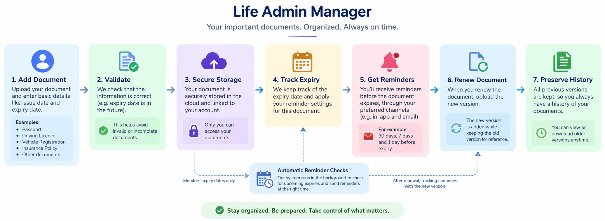

# 🗂️ Life Admin Manager

**Life Admin Manager** is a web application that helps people securely organize and keep track of their important personal documents in one place.

Documents like passports, driving licences, vehicle registrations, insurance policies, and other important records often have expiry dates that are easy to forget.

Life Admin Manager keeps track of these documents and reminds users when it is time to renew them.

---

## 💡 Why Life Admin Manager?

We manage many important documents in our everyday lives, and each one may have a different expiry date.

For example:

* Passport
* Driving Licence
* Vehicle Registration
* Vehicle Insurance
* Health Insurance
* Other personal documents

Instead of manually remembering all these dates, Life Admin Manager keeps track of them for you.

---

## ✨ Key Features

### 📄 Store Important Documents

Upload and organize important personal documents in one place.

### ⏰ Expiry Reminders

Receive reminders before a document expires.

> 🔔 Your Driving Licence expires in 7 days.

### 🔄 Document Renewal

Upload a renewed document while keeping the previous version for reference.

### ⚙️ Custom Reminders

Set different reminder periods for different documents.

For example:

> Passport → 30 days, 7 days and 1 day before expiry.

### 🔐 Secure & Private

Documents are linked to your account and are only accessible to you.

### 🗑️ Safe Deletion

Deleted documents are safely retained in the system for historical purposes.

---

## 🔄 How It Works

The basic journey is:

**Upload → Validate → Store → Track Expiry → Send Reminder → Renew → Preserve History**

---

## 🖥️ Technology

* **Angular** — Web application
* **Java Spring Boot** — Backend
* **PostgreSQL** — Database
* **Azure Blob Storage** — Document storage

---

## 🎯 Vision

The long-term goal of Life Admin Manager is to become a **personal digital assistant for managing everyday responsibilities** — starting with important documents and eventually expanding to other areas of life administration.
